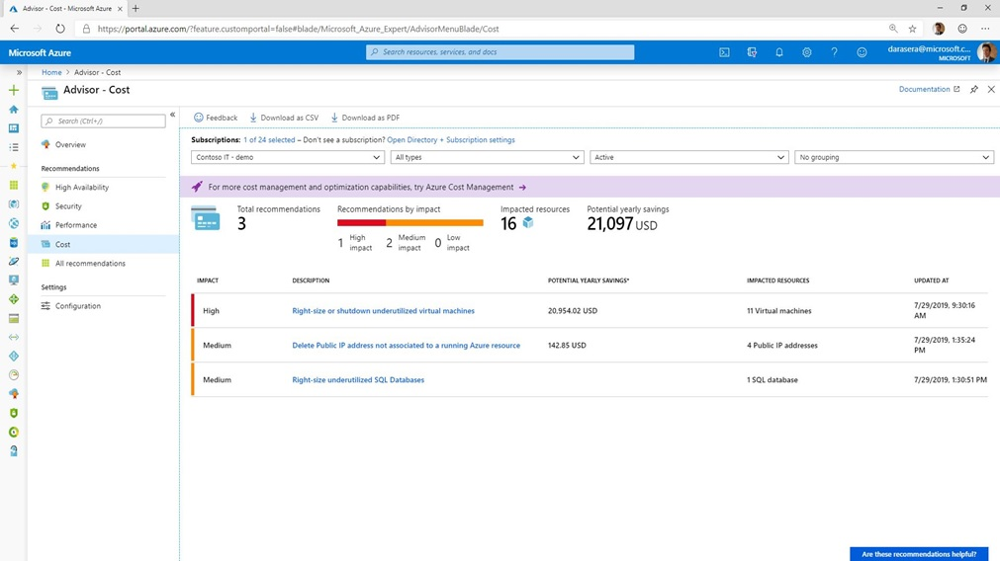

## Compute
Compute is typically a high-leverage area for cost optimization, as it encompasses much of the Infrastructure as a Service (IaaS) world. 

### Underutilized VMs
Many customers have underutilized, and even unused, VMs in their subscriptions of which they are unaware.
Depending on the family, they can add up to significant cost.
Non-prod environments are good places to start - developers and testers often spin up resources that
are used during the day, but sit idle at night and on weekends.
[This page](https://docs.microsoft.com/en-us/azure/automation/automation-solution-vm-management-config) has 
excellent information on automation VM shutdown and startup based on conditions such as time, CPU utilization, etc.

When discussing this topic with customers, it is important that they understand that there is no guarantee
that they will be able to create new VMs when others are deallocated.
This is especially vital to reinforce when the VMs are in regions having capacity issues.
You can check the capacity status of Azure regions [here](https://microsoft.sharepoint.com/teams/AzureServiceExperience/Pages/Capacity.aspx).

Good client-specific information on potentially underutilized VMs is available at the
[GearUp](https://gearup.microsoft.com/checklists/well-architected) site.

Azure Advisor has excellent recommendations on underutilized VMs. See a sample here: .

### Oversized VMs
These are similar to underutilized VMs, and also show up in Azure Advisor.
Oversized VMs are ones that are typically highly utilized, but are of a larger size (CPU, RAM, etc.) than usage
statistics show is necessary.
Often, dropping down to a [B-Series](https://docs.microsoft.com/en-us/azure/virtual-machines/sizes-b-series-burstable) "burstable" VM will still satisfy the usage and save money.

### Reserved Instances
There is some excellent customer-specific analysis of RIs at the [C&AI Customer Portal](https://caicustomers.microsoftonline.com/). Here is an example of a chart showing this: 

More detailed information that can be downloaded and analyzed in Excel is also available at this site.

### App Service Environment
Many customers, especially those in highly-regulated industries such as healthcare and financial services, are using [App Service Environments](https://docs.microsoft.com/en-us/azure/app-service/environment/intro) (ASE) over cheaper [App Services](https://docs.microsoft.com/en-us/azure/app-service/) because they wanted to avoid exposing the web applications and APIs running there from the public internet. In the past, using an ASE was the only way to accomplish this.

Recently, however, [Private Link](https://docs.microsoft.com/en-us/azure/private-link/private-link-overview) support has been added to App Services. This allows a customer to add a private IP address to an App Service, and then access it privately from other Azure services on VNets, or from on premises via a site-to-site Virtual Private Network (VPN) or ExpressRoute. This is a much less expensive alternative than running an ASE.

Note that there are other benefits provided by the ASE service that may require the client to remain on that environment.
However, the capabilities provided by Private Link solve address the primary reason many customers originally chose ASE over App Services.

### Virtual Machine Scale Sets
All too often, customers migrate workloads to Azure by spinning up a VM of similar size to the one running on premises and then forgetting about it. If the given workload increases, and vertical scaling doesn't make sense, they may add additional servers and put a load balancer in front of them.

While this satisifies the high-water peak usage needs, it often results in several VMs that have periods of little to no utilization, perhaps at night and over weekends. They pay a constant flat rate for all the servers instantiated.

Azure has a capability called [Virtual Machine Scale Sets](https://docs.microsoft.com/en-us/azure/virtual-machine-scale-sets/overview) (VMSS) that make it possible to increase or decrease the number of active VMs satisfying a given workload based on one or more criteria. For example, you could specify that another VM gets added to the pool if the average CPU usage reaches 75% for a five-minute period of time. Similarly, a VM could be dropped from the pool if the average CPU usage drops below 20% for the same period. In this way, customers can safely cover their peak compute needs while realizing potentially significant savings at low-usage times.

VMSS does not add additional costs beyond the VMs used and their associated resources.

### Optimize to Azure Functions or Azure Logic Apps
Often, a customer starts with a "Lift and Shift" from an on-premises workload to Azure.
This usually means simply moving everything in a "one size fits all" fashion, with little to no optimization.
While the use of [VMSSs](https://github.com/gamullen/Cost-Optimization-for-CSAs/blob/master/README.md#virtual-machine-scale-sets) as described above can help, there are some compute-intensive capabilities that lend themselves very well to migrating to
[Azure Functions](https://docs.microsoft.com/en-us/azure/azure-functions/) or to
[Azure Logic Apps](https://docs.microsoft.com/en-us/azure/logic-apps/).
Both services can be used on a purely consumption basis, meaning that the customer gets charged only for actual
invocations, with no ongoing chargeback when nothing is being executed.
Another benefit is that the underlying infrastruction automatically scales and contract without any customer intervention.
It's even more seamless and powerful than VMSSs - think electricity.

See [this page](https://docs.microsoft.com/en-us/azure/azure-functions/functions-compare-logic-apps-ms-flow-webjobs) for an excellent discussion of which Azure serverless compute option is the best fit for your workload.
