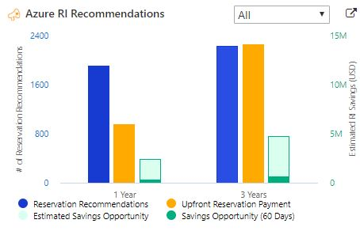

# Cost Optimization for CSAs
Cost optimization guidelines for CSAs

## Introduction
One of the primary job responsibilities of Cloud Solution Architects (CSA) is to help customers optimize their Azure spend. 
While there are many tools available to help with this, they are often spread out across multiple domains, and some are documented more as "tribal knowledge" than sharable guidelines.

The goal of this documentation is to provide CSAs with a repository to not only learn cost optimization ideas and best practices, but in addition serve as a place for them to add ones of their own.
If you want to assist, please contact [Gary Mullen-Schultz](mailto:gamullen@microsoft.com).

### Azure Advisor
[Azure Advisor](https://docs.microsoft.com/en-us/azure/advisor/advisor-overview) is a great first place to look for "low-hanging fruit" ideas on cost savings. Advisor also provides other valuable guidance for Azure usage, including:
* Security
* High Availability
* Operational Excellence
* Performance

We recommend this as your best first starting point for cost optimization analysis.

## Compute
Compute is typically a high-leverage area for cost optimization, as it encompasses much of the Infrastructure as a Service (IaaS) world. 

### Underutilized VMs
Good client-specific information on potentially underutilized VMs is available at the
[GearUp](https://gearup.microsoft.com/checklists/well-architected) site.

### Reserved Instances
There is some excellent customer-specific analysis of RIs at the [C&AI Customer Portal](https://caicustomers.microsoftonline.com/). Here is an example of a chart showing this: 

More detailed information that can be downloaded and analyzed in Excel is also available at this site.

### App Service Environment
Many customers, especially those in highly-regulated industries such as healthcare and financial services, are using [App Service Environments](https://docs.microsoft.com/en-us/azure/app-service/environment/intro) (ASE) over cheaper [App Services](https://docs.microsoft.com/en-us/azure/app-service/) because they wanted to avoid exposing the web applications and APIs running there from the public internet. In the past, using an ASE was the only way to accomplish this.

Recently, however, [Private Link](https://docs.microsoft.com/en-us/azure/private-link/private-link-overview) support has been added to App Services. This allows a customer to add a private IP address to an App Service, and then access it privately from other Azure services on VNets, or from on premises via a site-to-site Virtual Private Network (VPN) or ExpressRoute. This is a much less expensive alternative than running an ASE.

Note that there are other benefits provided by the ASE service that may require the client to remain on that environment.
However, the capabilities provided by Private Link solve address the primary reason many customers originally chose ASE over App Services.

### Virtual Machine Scale Sets
All too often, customers migrate workloads to Azure by spinning up a VM of similar size to the one running on premises and then forgetting about it. If the given workload increases, and vertical scaling doesn't make sense, they may add additional servers and put a load balancer in front of them.

While this satisifies the high-water peak usage needs, it often results in several VMs that have periods of little to no utilization, perhaps at night and over weekends. They pay a constant flat rate for all the servers instantiated.

Azure has a capability called [Virtual Machine Scale Sets](https://docs.microsoft.com/en-us/azure/virtual-machine-scale-sets/overview) (VMSS) that make it possible to increase or decrease the number of active VMs satisfying a given workload based on one or more criteria. For example, you could specify that another VM gets added to the pool if the average CPU usage reaches 75% for a five-minute period of time. Similarly, a VM could be dropped from the pool if the average CPU usage drops below 20% for the same period. In this way, customers can safely cover their peak compute needs while realizing potentially significant savings at low-usage times.

VMSS does not add additional costs beyond the VMs used and their associated resources.

## Data

### Right Size Underutilized SQL Databases

### Cosmos?

## Storage

### Hot vs. Cool vs. Archive

## Networking

### ExpressRoute SKUs
We had one customer who initially designed its network without using the commonly-recommended ["Hub and Spoke" architecture](https://docs.microsoft.com/en-us/azure/architecture/reference-architectures/hybrid-networking/hub-spoke).
Because of this, they eventually grew their subscriptions to a point where the Standard SKU was insufficient, as it limits 10 virtual network links per circuit. This, in turn, necessitated the Premium ExpressRoute SKU, which is significantly more expensive than the Standard SKU.

We worked with them to change to a Hub and Spoke network topology, allowing them to revert to the Standard SKU. In their case, this resulted in approximately $36K in savings annually. It also led to a more modern and flexible network architecture better suited for future growth.

### Unused Public IPs
Currently, static public IPs in Azure cost over $40 annually. Eliminating unused ones is simple.

## Governance

### Business-Unit Chargeback
