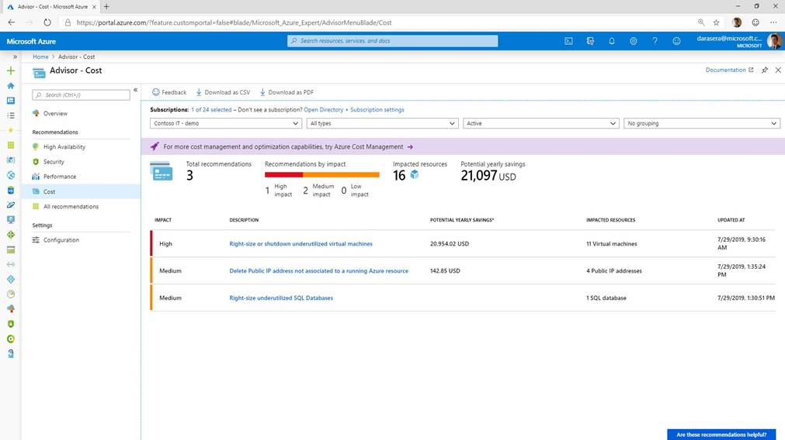
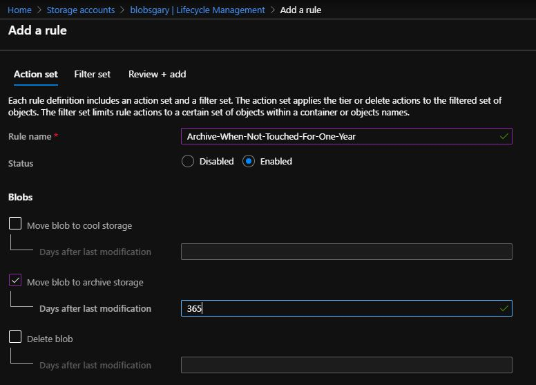

# Cost Optimization for CSAs
Cost optimization guidelines for CSAs

## Introduction
One of the primary job responsibilities of Cloud Solution Architects (CSA) is to help customers optimize their Azure spend and workloads.
While there are many tools available to help with this, they are often spread out across multiple domains, and some are documented more as "tribal knowledge" than sharable guidelines.

The goal of this documentation is to provide CSAs with a repository to not only learn cost optimization ideas and best practices, but in addition serve as a place for them to add ones of their own.
If you want to assist or have ideas to contribute, please contact [Gary Mullen-Schultz](mailto:gamullen@microsoft.com).

### Azure Advisor
[Azure Advisor](https://docs.microsoft.com/en-us/azure/advisor/advisor-overview) is a great first place to look for "low-hanging fruit" ideas on cost savings. Advisor also provides other valuable guidance for Azure usage, including:
* Security
* High Availability
* Operational Excellence
* Performance

We recommend this as your best first starting point for cost optimization analysis.

## Compute
Compute is typically a high-leverage area for cost optimization, as it encompasses much of the Infrastructure as a Service (IaaS) world. 

### Underutilized VMs
Many customers have underutilized, and even unused, VMs in their subscriptions of which they are unaware.
Depending on the family, they can add up to significant cost.
When discussing this topic with customers, it is important that they understand that there is no guarantee
that they will be able to create new VMs when others are deallocated.
This is especially vital to reinforce when the VMs are in regions having capacity issues.
You can check the capacity status of Azure regions [here](https://microsoft.sharepoint.com/teams/AzureServiceExperience/Pages/Capacity.aspx).

Good client-specific information on potentially underutilized VMs is available at the
[GearUp](https://gearup.microsoft.com/checklists/well-architected) site.

Azure Advisor has excellent recommendations on underutilized VMs. See a sample here: .

### Reserved Instances
There is some excellent customer-specific analysis of RIs at the [C&AI Customer Portal](https://caicustomers.microsoftonline.com/). Here is an example of a chart showing this: 

More detailed information that can be downloaded and analyzed in Excel is also available at this site.

### App Service Environment
Many customers, especially those in highly-regulated industries such as healthcare and financial services, are using [App Service Environments](https://docs.microsoft.com/en-us/azure/app-service/environment/intro) (ASE) over cheaper [App Services](https://docs.microsoft.com/en-us/azure/app-service/) because they wanted to avoid exposing the web applications and APIs running there from the public internet. In the past, using an ASE was the only way to accomplish this.

Recently, however, [Private Link](https://docs.microsoft.com/en-us/azure/private-link/private-link-overview) support has been added to App Services. This allows a customer to add a private IP address to an App Service, and then access it privately from other Azure services on VNets, or from on premises via a site-to-site Virtual Private Network (VPN) or ExpressRoute. This is a much less expensive alternative than running an ASE.

Note that there are other benefits provided by the ASE service that may require the client to remain on that environment.
However, the capabilities provided by Private Link solve address the primary reason many customers originally chose ASE over App Services.

### Virtual Machine Scale Sets
All too often, customers migrate workloads to Azure by spinning up a VM of similar size to the one running on premises and then forgetting about it. If the given workload increases, and vertical scaling doesn't make sense, they may add additional servers and put a load balancer in front of them.

While this satisifies the high-water peak usage needs, it often results in several VMs that have periods of little to no utilization, perhaps at night and over weekends. They pay a constant flat rate for all the servers instantiated.

Azure has a capability called [Virtual Machine Scale Sets](https://docs.microsoft.com/en-us/azure/virtual-machine-scale-sets/overview) (VMSS) that make it possible to increase or decrease the number of active VMs satisfying a given workload based on one or more criteria. For example, you could specify that another VM gets added to the pool if the average CPU usage reaches 75% for a five-minute period of time. Similarly, a VM could be dropped from the pool if the average CPU usage drops below 20% for the same period. In this way, customers can safely cover their peak compute needs while realizing potentially significant savings at low-usage times.

VMSS does not add additional costs beyond the VMs used and their associated resources.

### Optimize to Azure Functions or Azure Logic Apps
Often, a customer starts with a "Lift and Shift" from an on-premises workload to Azure.
This usually means simply moving everything in a "one size fits all" fashion, with little to no optimization.
While the use of [VMSSs](https://github.com/gamullen/Cost-Optimization-for-CSAs/blob/master/README.md#virtual-machine-scale-sets) as described above can help, there are some compute-intensive capabilities that lend themselves very well to migrating to
[Azure Functions](https://docs.microsoft.com/en-us/azure/azure-functions/) or to
[Azure Logic Apps](https://docs.microsoft.com/en-us/azure/logic-apps/).
Both services can be used on a purely consumption basis, meaning that the customer gets charged only for actual
invocations, with no ongoing chargeback when nothing is being executed.
Another benefit is that the underlying infrastruction automatically scales and contract without any customer intervention.
It's even more seamless and powerful than VMSSs - think electricity.

See [this page](https://docs.microsoft.com/en-us/azure/azure-functions/functions-compare-logic-apps-ms-flow-webjobs) for an excellent discussion of which Azure serverless compute option is the best fit for your workload.

## Data

### Right Size Underutilized SQL Databases
This is very similar to the underutilized VMs section [above](https://github.com/gamullen/Cost-Optimization-for-CSAs#underutilized-vms), but SQL resources can often be even more expensive than VMs.

### Cosmos?

## Storage

### Hot vs. Cool vs. Archive
Most customers start with hot storage for their needs, as it is the most performant. 
However, as data accumulate, it often happens that older blobs get accessed infrequently if at all.
In addition many clients, especially those in regulated industries, must follow archiving requirements. 

To address this, Azure has created three access tier levels: [hot, cool and archive](https://docs.microsoft.com/en-us/azure/storage/blobs/storage-blob-storage-tiers?tabs=azure-portal). They allow customers to pay less in exchange for reduced performance and access.

Although the access tier of any given blob can be changed individually (via the portal, PowerShell, etc.) this can be tedious
and time consuming for large amounts of data.
Azure has created [lifecycle management](https://docs.microsoft.com/en-us/azure/storage/blobs/storage-lifecycle-management-concepts?tabs=azure-portal) to address this.
This feature allows you to create rules to automatically move blobs between access levels based on "last touched" status.
For example, this rule sends a given blob to archive if it hasn't been accessed in one year:
.

## Networking

### ExpressRoute SKUs
We had one customer who initially designed its network without using the commonly-recommended ["Hub and Spoke" architecture](https://docs.microsoft.com/en-us/azure/architecture/reference-architectures/hybrid-networking/hub-spoke).
Because of this, they eventually grew their subscriptions to a point where the Standard SKU was insufficient, as it limits 10 virtual network links per circuit. This, in turn, necessitated the Premium ExpressRoute SKU, which is significantly more expensive than the Standard SKU.

We worked with them to change to a Hub and Spoke network topology, allowing them to revert to the Standard SKU. In their case, this resulted in approximately $36K in savings annually. It also led to a more modern and flexible network architecture better suited for future growth.

### Unused Public IPs
Currently, static public IPs in Azure cost over $40 annually. Eliminating unused ones is simple,
and Azure Advisor does a
nice job highlighting underutilized public IP addresses as shown in 
[this screenshot](https://github.com/gamullen/Cost-Optimization-for-CSAs/blob/master/README.md#underutilized-vms).

## Governance
Poor governance may be an area that doesn't jump to mind when discussion cost optimization,
but it can play a signficant direct and indirect role.

### Business-Unit Chargeback
Often, customers start small with Azure and move one or two workloads over.
At times, there is little discussion about what business unit will be paying for the services, and the IT department ends
up footing the bill.
This may work well for a while, but it will inevitibly reach a point where the monthly Azure spend is 
pushing the IT department's budget.
A side effect of this is that the actual business units benefiting from their solutions running in Azure have no incentive
to optimize their applications via many of the means described in this document, driving up costs.

Microsoft has extensive internal experience with Azure Governance, as it needs to optimize how it runs all its own
SaaS solutions (Microsoft365, Dynamics, etc.) on Azure.
This guidance has been well documented on the [Azure Governance](https://azure.microsoft.com/en-us/solutions/governance/) site.
Note that governance covers more than pure Azure costs - it also results in better operations, management, extensibility, security, etc.
