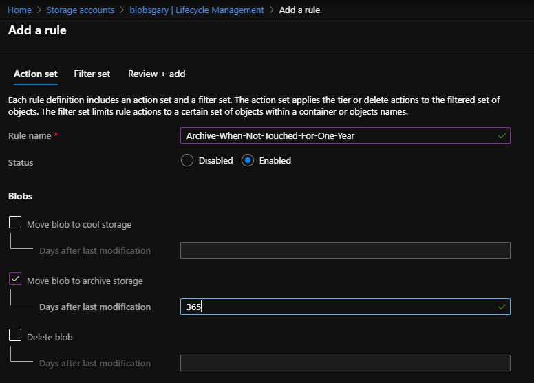

## Storage

### Hot vs. Cool vs. Archive
Most customers start with hot storage for their needs, as it is the most performant. 
However, as data accumulate, it often happens that older blobs get accessed infrequently if at all.
In addition many clients, especially those in regulated industries, must follow archiving requirements. 

To address this, Azure has created three access tier levels: [hot, cool and archive](https://docs.microsoft.com/en-us/azure/storage/blobs/storage-blob-storage-tiers?tabs=azure-portal). They allow customers to pay less in exchange for reduced performance and access.

Although the access tier of any given blob can be changed individually (via the portal, PowerShell, etc.) this can be tedious
and time consuming for large amounts of data.
Azure has created [lifecycle management](https://docs.microsoft.com/en-us/azure/storage/blobs/storage-lifecycle-management-concepts?tabs=azure-portal) to address this.
This feature allows you to create rules to automatically move blobs between access levels based on "last touched" status.
For example, this rule sends a given blob to archive if it hasn't been accessed in one year:
.
